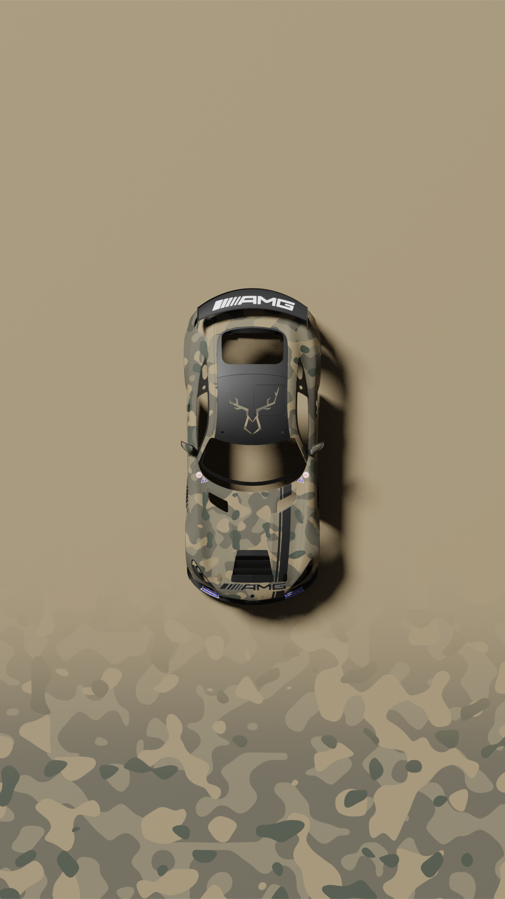
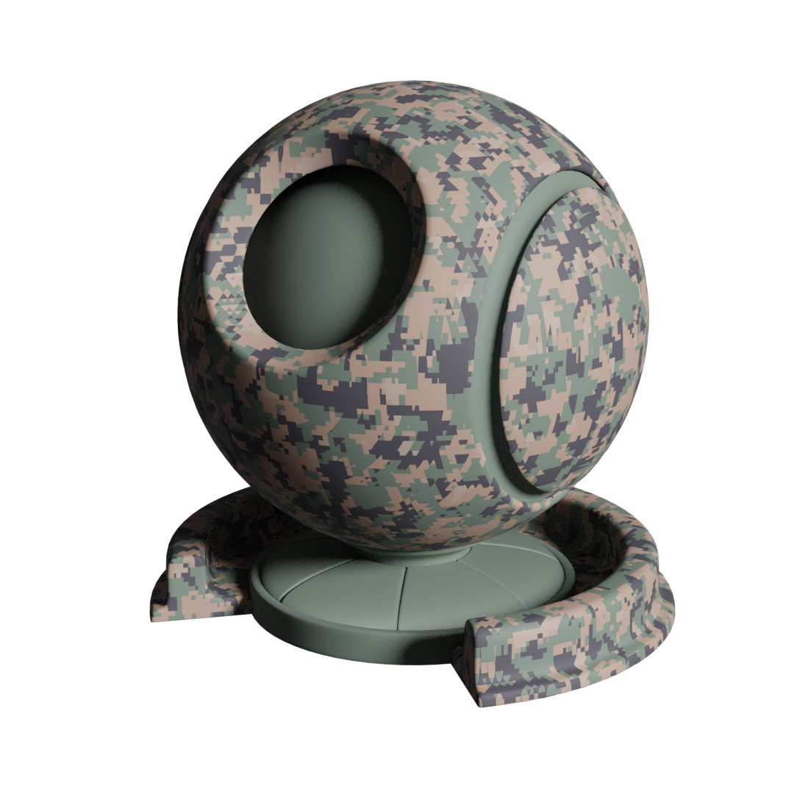

# ACC - Procedural Liveries - Template

This project contains shader templates to bake procedurally generated patterns onto your meshes to create custom liveries for Assetto Corsa Competizione. (Works for other games aswell, depending on the workflow to get the textures in the game).

<b>Previews</b>

---
<!-- Topography Pattern -->

<b>Topography Pattern</b>

---

 
This is a topography inspired pattern imitating the lines on maps to visualize elevation

<!--
**Features**: 
&bullet; Opacity Mask Shader to generate an alpha mask to repack into the final texture. This allows to select a color for lines within the ingame editor.
-->

<!-- /Topography Pattern -->

<!-- Disruptive Pattern -->

<b>Disruptive Camo Pattern</b>

---

 
Inspired by the most commonly used Type of disruptive Camo Patterns by Militaries around the Globe

<!-- /Disruptive Pattern -->

<!-- Pixel Pattern -->

<b>Pixel Camo Pattern</b>

---

 
Inspired by Pixelated Camo Patterns used by North-American Militaries (Marpat, Cadpat, ACU...)

<!-- !Pixel Pattern -->

<!-- Splinter Pattern -->

<b>Splinter Camo Pattern</b>

---

 
Inspired by the Swedish Army M90 Camo Pattern

<!-- !Splinter Pattern -->

 

&nbsp;&nbsp;<b>Usage</b>

---
This is not a complete Guide to create a custom Livery. This Guide only describes how to generate a Texture for a UV-Mapped Mesh using the included Shaders and Materials. You will need to obtain the Object Files for the Vehicles exteriour Mesh from the Game to generate a Texture. 

- Download and Install Blender
(https://www.blender.org/download/)

- Download the Project from Github (Code -> Download ZIP)

Extract the Project Files and open the Blender Project

- Import the 3D-Object (File -> Import -> Select Format)

Make sure the imported Object is selected through the whole Process (Objectname highlighted orange)

- Adjust the Imported Objects Scale to roughly authentic Dimensions and Apply Scale (Object -> Apply -> Scale)

This is necessary for proper Texture Scaling

- Switch to the 'Materials Tab' and remove the imported Materials from the Object

- In the 'Materials' Tab select one of the provided Template Materials

- With a Material selected open the Shader Editor (Editor Type -> Shader Editor)

- In the Shader Editor right click anywhere to add a new 'Image Texture' Node as Bake Texture with the required Texture Attributes

- With the new Image Texture selected (white outline) switch to the 'Scene Tab' and open the 'Bake' Menu. Set the Bake Type to Diffuse and Contributions to Color only. Then hit Bake
 
Wait until the Bake Process finishes (Progress Bar in Status Bar at the bottom)

- Change to the Image Editor (Editor Type -> Image Editor) and select the newly baked Texture

- Save the baked Image

You are done, now you can use the exported Pattern with your preferred Image Editor to create the custom Livery

 

&nbsp;&nbsp;<b>Known Issues</b>

---
&bullet; Distortion on Topography Pattern: 
The directional resampling along the axes to create the outline needs to be extended to clean up inconsistent sampling of corners 

&bullet; Warp on Pixel Camos: 
Its not possible to project uniform sqares onto complex non uniform geoetry without warp. This is visible on rounded areas of the geometry.
 

